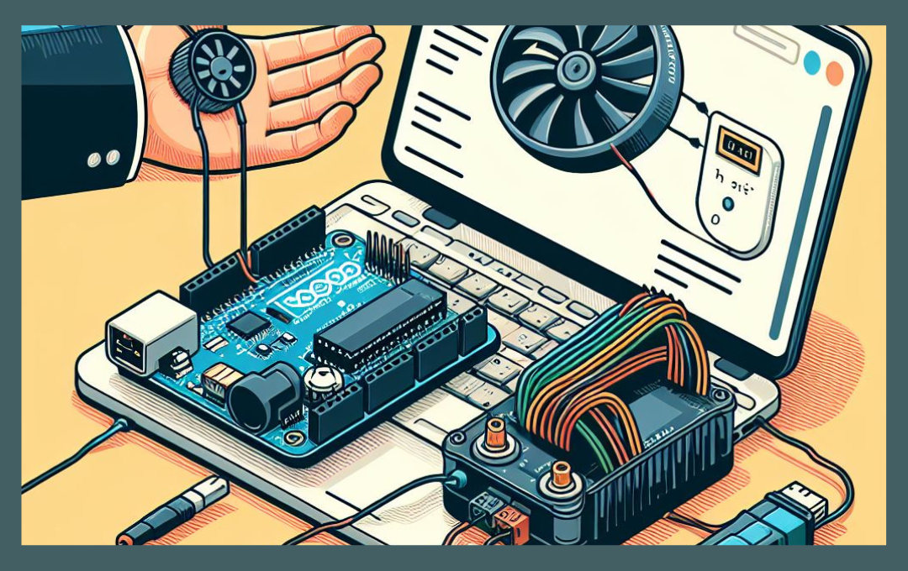
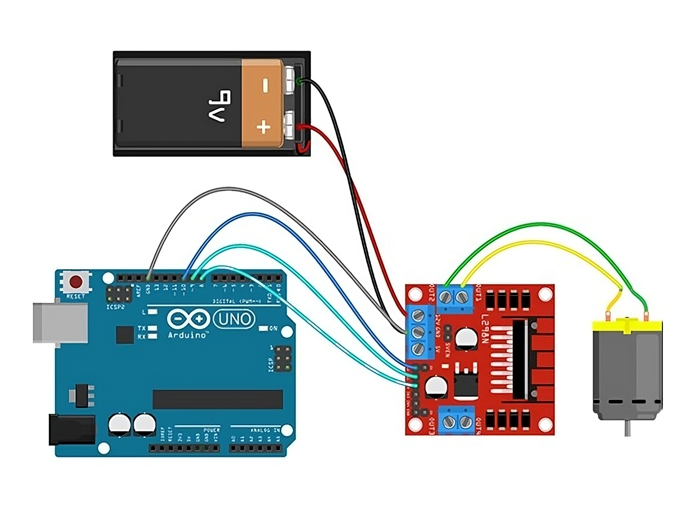

# AI AutoMotor Contoller System

## Repo Structure

```
    ├── docs                                   # Contains documents.
    ├── research                               # Contains pre-research experiments.
    ├── source                                 # Contains project source code.
    │   ├── modules                                # Contains custom dependencies.  
    │   ├── main.py                                # main file.
    └── README.MD                              # Readme Content.
```

## 01 Introduction

This system uses Arduino, Computer Vision, and gesture detection technology to automate the Pulse Width Modulation (PWM) process. It combines the capabilities of these technologies to offer a seamless and intuitive control experience. 

The MediaPipe library accurately detects hand gestures and calculates the distance between the THUMB_TIP and INDEX_FINGER_TIP. This estimated distance is then used to adjust the motor speed dynamically, resulting in precise and accurate control.



## 02 Technology Stack

### 2.1 Hardware Stack

- Arduino UNO
- DC Motor (1)
- L298N Motor Controller (1)
- 9V Battery 
- Jumper Wires

### 2.2 Software Stack

- Python 3.8.5 (Recommended)
- Arduino IDE (Framework)
- OpenCV
- MediaPipe
- PyFirmata

### 2.3 MediaPipe Hand Landmarks


## 03 Setup

### 3.1 Hardware Setup



| Connections     | Pin No  |
| --------------- | ------- |
| **PWM Enable**  | Pin: 10 |
| **Motor IN 1**  | Pin: 9  |
| **Motor IN 2**  | Pin: 8  |

### 3.2 Firmware Setup

Setting up the Arduino firmware is necessary to enable communication between Python and Arduino. The Firmata protocol establishes serial communication between a Python script and an Arduino.

To upload Firmata, open Arduino IDE and choose the correct COM port and **File -> Examples -> Firmata -> StandardFirmata -> Upload to Arduino UNO Board**.


**Note:** After uploading StandardFirmata to the Arduino Board, Python can be used to program it.

### 3.3 Setup Software

We will now install the necessary tools to gain access to the Arduino Board. This project utilizes essential libraries, including MediaPipe and PyFirmata. We need to install all the required dependencies on the development computer.

- **Step 01:** Install Python

  ```
  Ver: 3.8.5 is Recommended (www.python.org)
  ```

- **Step 02:** Navigate to the specified location in CMD/Terminal.

  ```
  ai-automotor-contoller-system/docs/requirements.txt
  ```

- **Step 03:** Execute the given command to install all dependencies.

  ```
  pip install -r requirements.txt
  ```

## 04 Usage

- **Source Directory:**

  ```
  ai-automotor-contoller-system\source\main.py
  ```

### 4.1 Setps to run

- **Step 01:** Connect the Arduino to the development computer.

- **Step 02:** Modify the script to reflect the appropriate COM port.

  

- **Step 03:** Run app.

  ```
  python source/main.py
  ```

### 4.2 Output

[4-demo-video.webm](https://github.com/gunarakulangunaretnam/ai-automotor-contoller-system/assets/45822509/f6cc8c83-8e73-4ddd-b1c7-ea6e21f696ff)

## Social Links

- [Linkedin Profile](https://www.linkedin.com/in/gunarakulangunaretnam)
- [Facebook Profile](https://www.facebook.com/gunarakulangunaratnam)
- [Instagram Profile](https://www.instagram.com/gunarakulangunaretnam)
- [Twitter Profile ](https://twitter.com/gunarakulangr)
- [Kaggle Profile](https://www.kaggle.com/gunarakulangr)
- [TikTok Profile](https://www.tiktok.com/@gunarakulangunaretnam)
- [Youtube Profile](https://www.youtube.com/channel/UCMWkED5sabgVZSCKjZuRJXA)
